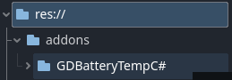
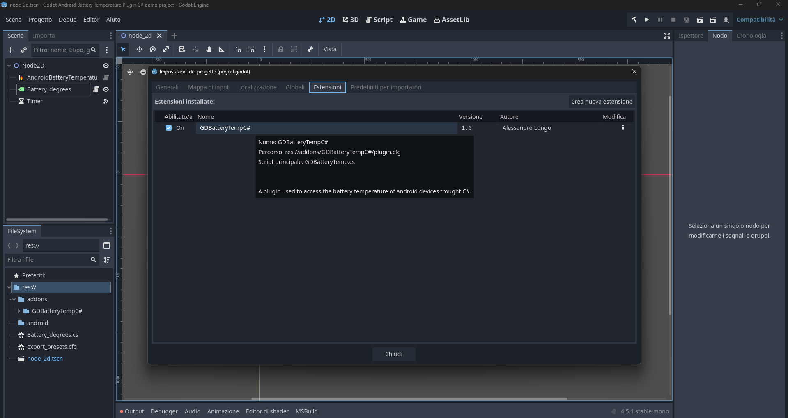
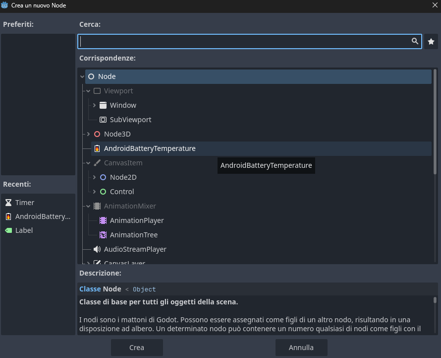
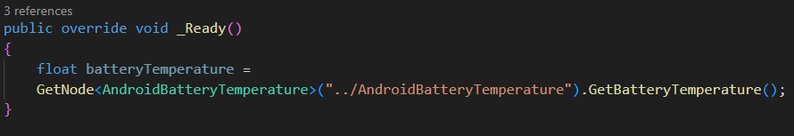
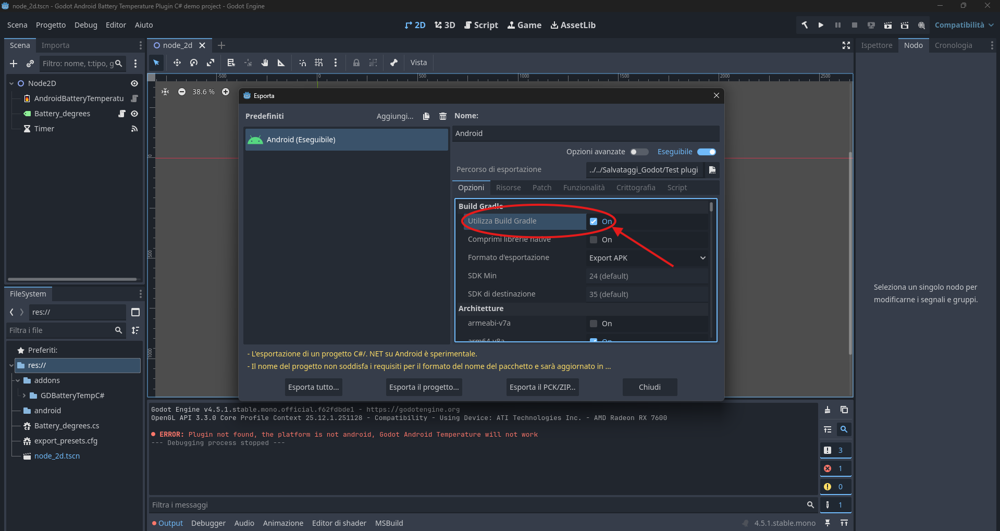

# Godot-Android-Battery-Temperature-Plugin-C#
Android plugin for Godot used to access the battery temperature of android devices. It should work on Godot versions 4.2+ but it has only been tested in version 4.5.1 and 4.2
This plugin has also a gdscript version [click here](https://github.com/Sandroman09/Godot-Android-Battery-Temperature-Plugin/tree/main?tab=readme-ov-file)

## How to use it
1) Copy the addons folder into your Godot project.
   
   
  
2) Activate the plugin in the project settings (If you get an error about the script make sure to build the C# project).
   
   

3) Add a new node and select GodotAndroidBatteryTemperature.

   
  
4) On the GodotAndroidBatteryTemperature node you will be able to call the GetBatteryTemperature() method, it will return the battery temperature

   
   
5) If you are exporting the project to android remember to enable gradle build otherwise the plugin won't work.
   

There is also a demo project avaiable if you want to test the plugin, you can find it in the "Godot Android battery temperature plugin C# demo project" folder.
Feel free to open an issue if there is something wrong or if the plugin doesn't work on a specific godot version.
